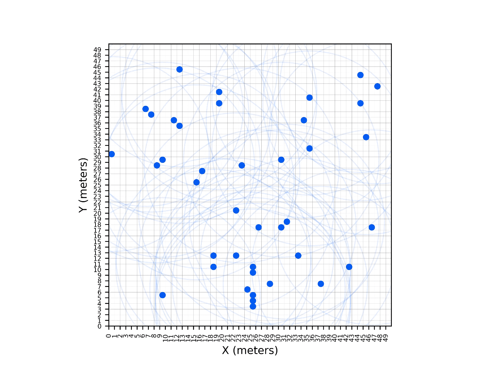

# Gibbs Swarm Coordination

Implementation a decentralized coordination of autonomous swarms using parallel Gibbs sampling.

## Rendezvous Problem

- Initial Configuration


- After 300 iterations


- After 500 iterations


# Reference
TAN, Xiaobo; XI, Wei; BARAS, John S. Decentralized coordination of autonomous swarms using parallel Gibbs sampling. Automatica, v. 46, n. 12, p. 2068-2076, 2010.

```
@article{tan2010decentralized,
  title={Decentralized coordination of autonomous swarms using parallel Gibbs sampling},
  author={Tan, Xiaobo and Xi, Wei and Baras, John S},
  journal={Automatica},
  volume={46},
  number={12},
  pages={2068--2076},
  year={2010},
  publisher={Elsevier}
}
```


